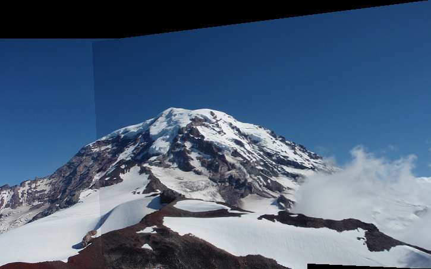

## Let's make a panorama! ##

    image panorama_image(image a, image b, float sigma, float thresh, int nms, float inlier_thresh, int iters, int cutoff)
    {
        // Calculate corners and descriptors
        descriptor *ad = harris_corner_detector(a, sigma, thresh, nms, &an);
        descriptor *bd = harris_corner_detector(b, sigma, thresh, nms, &bn);

        // Find matches
        match *m = match_descriptors(ad, an, bd, bn, &mn);

        // Run RANSAC to find the homography
        matrix H = RANSAC(m, mn, inlier_thresh, iters, cutoff);

        // Stitch the images together with the homography
        image comb = combine_images(a, b, H);
        return comb;
    }

## 1. Harris corner detection ##

    Calculate image derivatives Ix and Iy.
    Calculate measures IxIx, IyIy, and IxIy.
    Calculate structure matrix components as weighted sum of nearby measures.
    Calculate Harris "cornerness" as estimate of 2nd eigenvalue: det(S) - α trace(S)^2, α = .06
    Run non-max suppression on response map

### 2. Make a fast smoother ###

If you want a fast corner detector you can decompose the Gaussian blur from one large 2d convolution to 2 1d convolutions. Instead of using an N x N filter you can convolve with a 1 x N filter followed by the same filter flipped to be N x 1.

Fill in `image make_1d_gaussian(float sigma)` and `image smooth_image(image im, float sigma)` to use this decomposed Gaussian smoothing.

## 1.2 Computer cornerness from structure matrix ##

## 1.3 Non-maximum suppression ##

We only want local maximum responses to our corner detector so that the matching is easier. Fill in `image nms_image(image im, int w)`.

For every pixel in `im`, check every neighbor within `w` pixels (Chebyshev distance). Equivalently, check the `2w+1` window centered at each pixel. If any responses are stronger, suppress that pixel's response (set it to a very low negative number).

Corners are marked with the crosses. They seem pretty sensible! Lots of corners near where snow meets rock and such. Try playing with the different values to see how the affect our corner detector.

## 2 Patch matching ##

To get a panorama we have to match up the corner detections with their appropriate counterpart in the other image. The descriptor code is already written for you. It consists of nearby pixels except with the center pixel value subtracted. This gives us some small amount of invariance to lighting conditions.

## 2.1 Distance metric ##
For comparing patches we'll use L1 distance. Squared error (L2 distance) can be problematic with outliers as we saw in class. We don't want a few rogue pixels to throw off our matching function. L1 distance (sum absolute difference) is better behaved with some outliers.

Implement float `l1_distance(float *a, float *b, int n)` between two vectors of floats. The vectors and how many values they contain is passed in.

## 2.2a Find the best matches from a to b ##

First we'll look through descriptors for `image a` and find their best match with descriptors from `image b`. Fill in the first `TODO` in `match *match_descriptors(descriptor *a, int an, descriptor *b, int bn, int *mn)`.

## 2.2b Eliminate multiple matches to the same descriptor in b  ##

Each descriptor in `a` will only appear in one match. But several of them may match with the same descriptor in `b`. This can be problematic. Namely, if a bunch of matches go to the same point there is an easy homography to estimate that just shrinks the whole image down to one point to project from `a` to `b`. But we know that's wrong. So let's just get rid of these duplicate matches and make our matches be one-to-one.

## 3. Fitting our projection to the data ##

Now that we have some matches we need to predict the projection between these two sets of points! However, this can be hard because we have a lot of noisy matches. Many of them are correct but we also have some outliers hiding in the data.

## 3.1 Projecting points with a homography ##

Implemented `point project_point(matrix H, point p)` to project a point using matrix `H`. You can do this with the provided matrix library by calling `matrix_mult_matrix` (see `src/matrix.c`). 

## 3.2a  Calculate distances between points ##

`float point_distance(point p, point q)`. L2 distance.

## 3.2b Calculate model inliers ##

Figure out how many matches are inliers to a model. 

## 3.3 Randomize the matches ##

One of the steps in RANSAC is drawing random matches to estimate a new model. One easy way to do this is randomly shuffle the array of matches and then take the first `n` elements to fit a model.

Implemented the [Fisher-Yates shuffle](https://en.wikipedia.org/wiki/Fisher%E2%80%93Yates_shuffle#The_modern_algorithm) in `void randomize_matches(match *m, int n)`.

## 3.4 Fitting the homography ##

## 3.5 Implement RANSAC ##

## 4. Cylindrical Mapping ##

Mapping all the images back to the same coordinates is bad for large field-of-view panoramas, as discussed in class.# Panorama-Implementation
